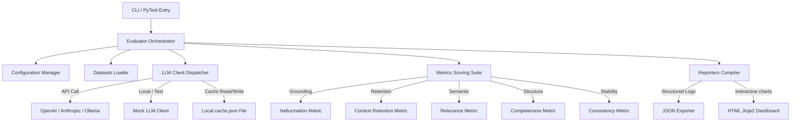

# 🛡️ AI Quality Evaluation & Prompt Regression Framework

[](https://github.com)
[](https://www.python.org/)
[](https://opensource.org/licenses/MIT)
[](https://pytest.org)
[](https://www.docker.com/)

A enterprise-grade Python evaluation engine designed to benchmark LLM completions, detect regressions during prompt iteration, and auto-compile interactive glassmorphic quality dashboards.

---

## 📖 Table of Contents
1. [Core Features](#-core-features)
2. [Architecture Blueprint](#-architecture-blueprint)
3. [Project Directory Structure](#-project-directory-structure)
4. [Getting Started](#-getting-started)
5. [CLI Command Reference](#-cli-command-reference)
6. [PyTest Integration](#-pytest-integration)
7. [How to Extend (Writing Custom Metrics)](#-how-to-extend-writing-custom-metrics)
8. [Dockerization](#-dockerization)

---

## ✨ Core Features

* **🔌 Multi-Provider LLM Client**: Unified interface supporting **OpenAI** (GPT-4/GPT-3.5), **Anthropic** (Claude-3), **Ollama** (local models), and an offline **Mock Provider** for keyless CI stability.
* **📈 Rich Factual & Semantic Metrics**:
  * **Hallucination Detection**: Content noun/number grounding and TF-IDF semantic overlap verification against source context.
  * **Context Retention**: Keyword extraction coverage and context window size utilization analysis.
  * **Relevance Scoring**: Jaccard keyword overlaps blended with TF-IDF cosine similarity.
  * **Completeness Checks**: Adequacy length checks and paragraph-level structural validations (intro, body, conclusion).
  * **Response Consistency**: stability statistics and runs variance calculations across parallel evaluation loops.
* **⚡ Caching & Thread-Pool Concurrency**: Thread-pool workers executing requests in parallel, with file-persistent caches (`reports/.cache.json`) to control API token billing.
* **📊 Glassmorphic HTML Dashboard**: Self-contained interactive report featuring Plotly charts, category pass rates, latencies, estimated costs, and real-time client-side search/filtering.

---

## 🎨 Architecture Blueprint



---

## 📁 Project Directory Structure

```text
ai-quality-framework/
├── config/
│   ├── config.yaml          # Global workers, caching, and default models
│   ├── models.yaml          # Pricing rates and context windows per model
│   └── metrics_config.yaml  # Default pass/fail score thresholds
├── src/
│   ├── core/
│   │   ├── llm_client.py    # Unified client, retry decorators, and cost trackers
│   │   ├── metrics.py       # BaseMetric interface and metrics formulas
│   │   └── evaluator.py     # Concurrent runner and cache serializations
│   ├── reporters/
│   │   ├── html_reporter.py # Renders HTML and embeds Plotly chart scripts
│   │   ├── json_reporter.py # Raw logs serialization
│   │   └── dashboard.py     # Background HTTP server and local browser hosting
│   ├── data/
│   │   ├── datasets/        # Golden, Edge, and Domain JSON datasets
│   │   └── prompts/         # Versioned prompt templates for regression checks
│   ├── utils/
│   │   ├── config.py        # Settings parser and loader
│   │   ├── logger.py        # Loguru console and rotation logfile configuration
│   │   └── validators.py    # JSON Schema validator for dataset files
│   └── main.py              # Central CLI route module
├── tests/                   # Internal unit tests checking framework modules
├── reports/                 # Output directories for HTML/JSON execution summaries
├── pytest.ini               # Test configuration markers
├── setup.py                 # Setuptools installer
├── Dockerfile               # Multi-stage image build file
└── docker-compose.yml       # Docker compose multi-service router
```

---

## 🛠️ Getting Started

### 1. Prerequisites
Ensure you have **Python 3.8+** installed on your system.

### 2. Set up the Environment
Clone this project and navigate to its root folder:
```bash
git clone <repository_url>
cd "AI QE PRF"
```

Create and activate a Python virtual environment:
```bash
# Create
python -m venv venv

# Activate (Windows PowerShell)
.\venv\Scripts\activate

# Activate (macOS/Linux)
source venv/bin/activate
```

Install the required packages and install the codebase in editable mode:
```bash
pip install -r requirements.txt
pip install -e .
```

### 3. Add API Keys
Copy the example environment file:
```bash
cp .env.example .env
```
Open the `.env` file and insert your API keys:
```env
OPENAI_API_KEY=sk-...
ANTHROPIC_API_KEY=key-...
```
*Note: If no keys are specified, the framework runs safely using simulated responses of the Mock Client.*

---

## 💻 CLI Command Reference

Execute commands directly via `python src/main.py` or the `ai-quality` package entrypoint.

| Action | Command Example | Purpose |
| :--- | :--- | :--- |
| **Scaffold** | `python src/main.py init --project-name eval_project` | Set up a new evaluation project skeleton |
| **Validate** | `python src/main.py validate --dataset src/data/datasets/golden_dataset.json` | Validate dataset formats against the schema |
| **Run** | `python src/main.py run --suite golden --model mock` | Execute evaluation runs on golden/edge cases |
| **Compare** | `python src/main.py compare --v1 src/data/prompts/v1_prompts.yaml --v2 src/data/prompts/v2_prompts.yaml` | Compare average quality scores across prompt revisions |
| **Analyze** | `python src/main.py analyze --run-id latest --pattern all` | Group failures by category and check refusal patterns |
| **Host** | `python src/main.py dashboard --port 8000` | Launch local HTTP dashboard and open browser |

---

## 🧪 PyTest Integration

The framework integrates with **PyTest** for execution inside CI/CD pipelines.

### Run Internal Unit Tests
Runs the testing assertions checking evaluator cache keys, reporter compilers, and metrics algebra:
```bash
pytest tests/ -v
```

### Run Suite Evaluations
Evaluates the golden dataset files using parameterized test loops:
```bash
pytest src/tests/ -v --html=reports/pytest_report.html --self-contained-html
```

---

## 🔌 How to Extend (Writing Custom Metrics)

Adding a custom quality metric is extremely simple. Inherit from `BaseMetric` inside `src/core/metrics.py`:

```python
from core.metrics import BaseMetric, MetricResult

class CodeSafetyMetric(BaseMetric):
    """Checks if response contains dangerous bash/python calls."""
    def __init__(self, threshold: float = 1.0):
        super().__init__("code_safety_score", threshold)

    def evaluate(self, response: str, **kwargs) -> MetricResult:
        dangerous_terms = ["rm -rf", "shred", "drop database", "os.system"]
        # Look for dangerous substrings
        violations = [term for term in dangerous_terms if term in response.lower()]
        
        score = 1.0 if not violations else 0.0
        passed = score >= self.threshold
        
        return MetricResult(
            metric_name=self.name,
            score=score,
            passed=passed,
            threshold=self.threshold,
            details={"violations_detected": violations}
        )
```

Register your custom metric class in the `Evaluator` initialization loop (`src/core/evaluator.py`) to expose it to datasets configuration checks.

---

## 🐳 Dockerization

### Build Image
```bash
docker build -t ai-quality-framework:latest .
```

### Run using Docker Compose
```bash
# Run the default suite
docker-compose up

# Run regression tests inside container
docker-compose exec app python src/main.py compare --v1 src/data/prompts/v1_prompts.yaml --v2 src/data/prompts/v2_prompts.yaml
```
*Docker Compose maps local volumes to `/app/reports`, ensuring HTML dashboards are persisted directly back to your local workspace.*
